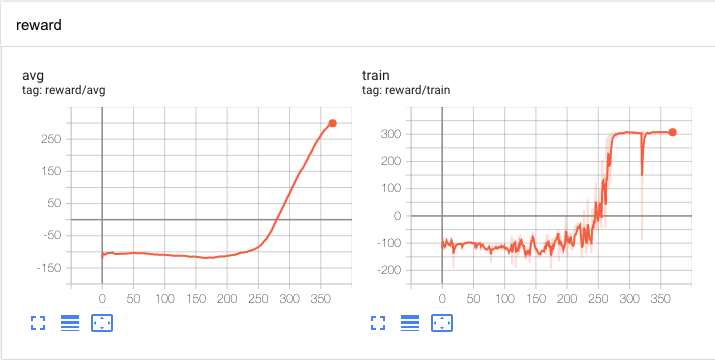
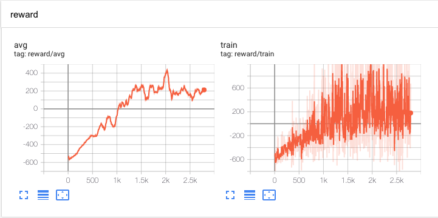

# SAC BipedalWalkerHardcore

> A sample code used to solve BipedalWalker-v3 & BipedalWalkerHardcore-v3

## Requirement

* [python 3.7](https://www.python.org) 
* [pytorch 1.0.1](https://pytorch.org/) [ Warning ! ]
* (I ever used v1.7, the I watse a month to deal with it using the same code but without any network changes, please be careful!)
* [gym 0.13.1](https://github.com/openai/gym)


## Hyperparameters

Agent uses the following hyperparameters:

```
gamma=0.99
batch_size=256
lr=5e-4
hidden_size=400
tau=0.005
alpha=0.2
reward_scale = 5 // reward *= reward_scale
capacity=2000000
```

## How to use my code?

1. Train from blank network

```dotnetcli
$ python main.py --train=1
```

2. Train from exist network

```dotnetcli
$ python main.py --train=1 --load=1
```

3. Play with the network

```dotnetcli
$ python main.py --load=1 --render=1
```

## MyResult

BiliBili: *

### Bipedalwalker



### BipedalwalkerHardcore



## Credit

Pranjal Tandon (https://github.com/pranz24).
