# BipedalWalker Test With Different Params (SAC)


- [BipedalWalker Test With Different Params (SAC)](#bipedalwalker-test-with-different-params-sac)
  - [0. My Note](#0-my-note)
    - [(1) Base Program Framework](#1-base-program-framework)
    - [(2) Update Accroding to Paper](#2-update-accroding-to-paper)
    - [(3) Actor Sample Action Process](#3-actor-sample-action-process)
    - [(4) Network Update Comprehension](#4-network-update-comprehension)
  - [Successful Origin Training Params](#successful-origin-training-params)
  - [1. LOG_STD_MAX](#1-log_std_max)
    - [tanh(x) Probability Density Function with Different STD](#tanhx-probability-density-function-with-different-std)
    - [Training With Different LOG_STD_MAX](#training-with-different-log_std_max)
    - [The Phenomenon](#the-phenomenon)
    - [Reason](#reason)
    - [Conclusion](#conclusion)
  - [2. Cross training](#2-cross-training)
    - [Cross-Training VS Random-Only-Training VS Eval-Only-Training](#cross-training-vs-random-only-training-vs-eval-only-training)
  - [3. soft-update tau](#3-soft-update-tau)
  - [4. alpha (entropy offset param)](#4-alpha-entropy-offset-param)
  - [Questions](#questions)

## 0. My Note

### (1) Base Program Framework

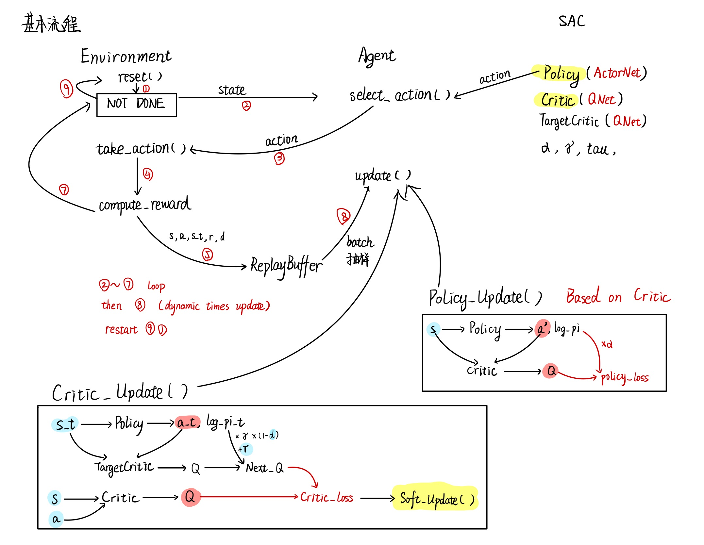

### (2) Update Accroding to Paper

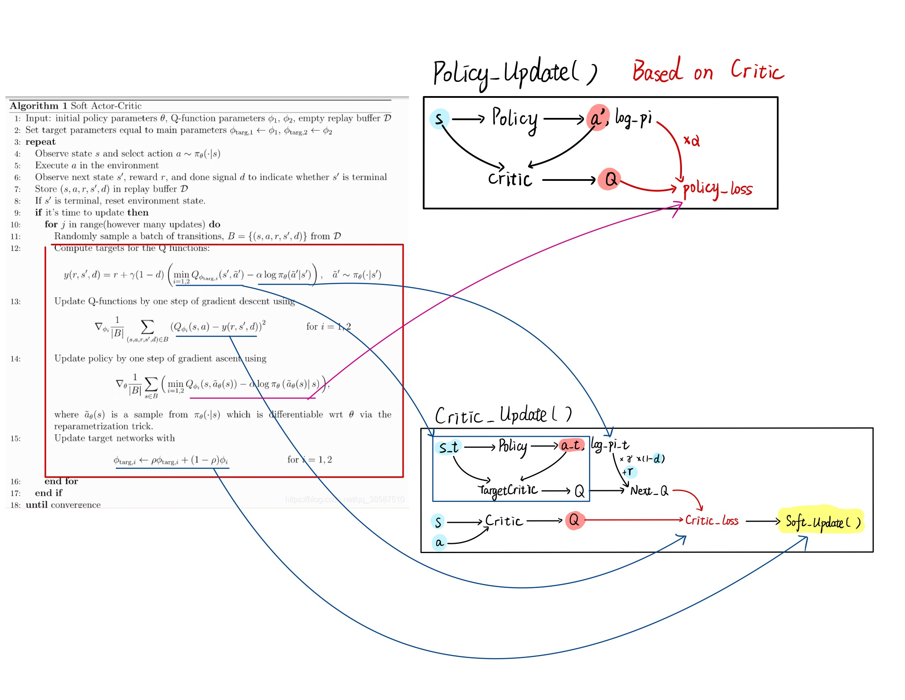

### (3) Actor Sample Action Process

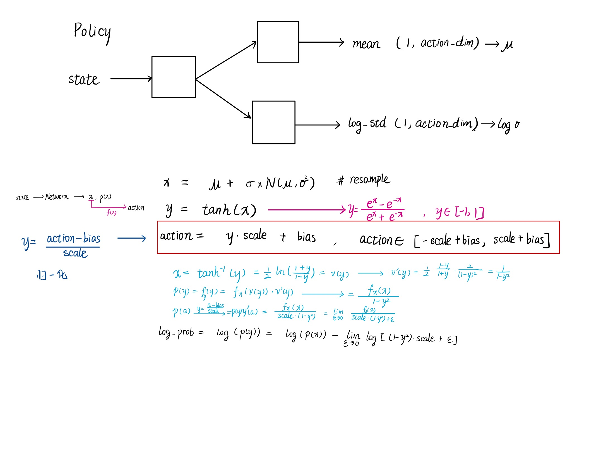

### (4) Network Update Comprehension

[A Question](#questions)

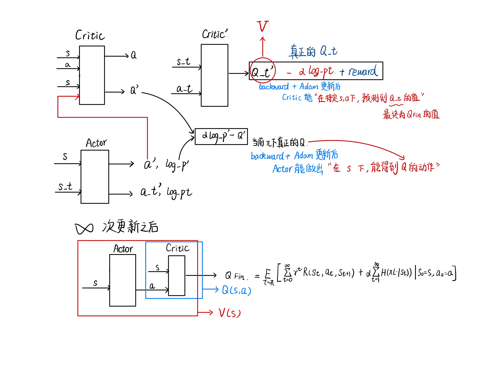

===============

> Control other params And Only change the researching Param  
> I use a scale(5) to multipy the reward, and the max episode reward in walker2D will be 1500 avg.

## Successful Origin Training Params

```
gamma=0.99
batch_size=256
lr=3e-4
hidden_size=256
tau=0.005
alpha=0.2

LOG_SIG_MAX = 2
LOG_SIG_MIN = -20
epsilon = 1e-6

evaluate = false
```

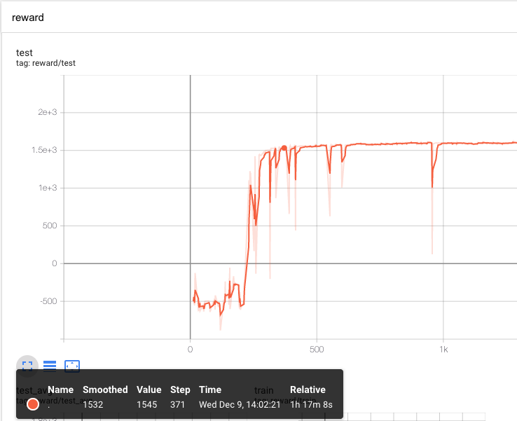

## 1. LOG_STD_MAX

```
origin output is Mean = 0
random output is y = tanh(x) while x is from Normal(mean, STD)
```

### tanh(x) Probability Density Function with Different STD

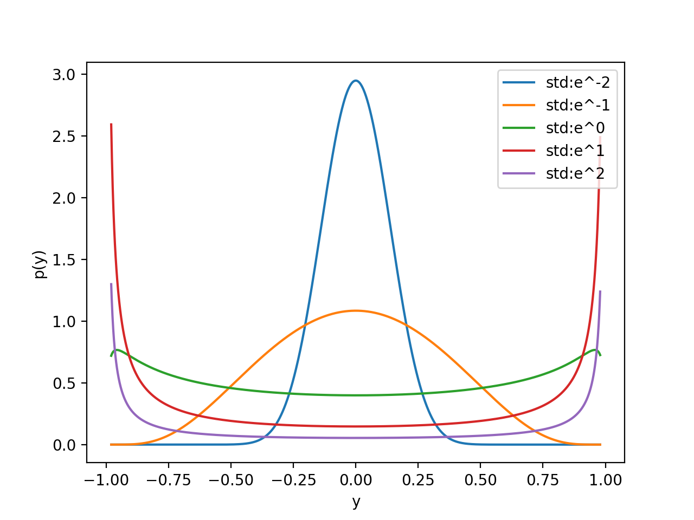

### Training With Different LOG_STD_MAX

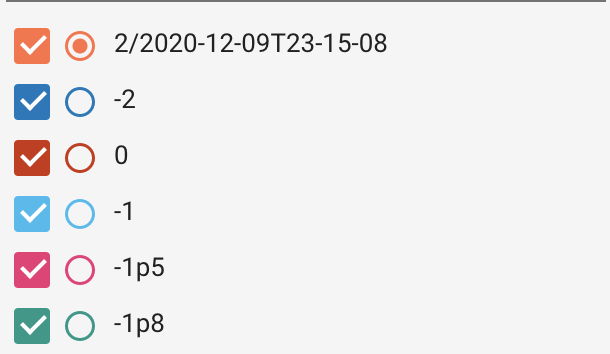

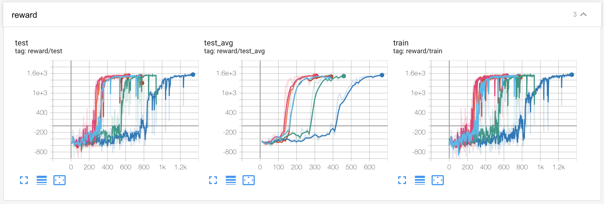

### The Phenomenon

According to Soft-Actor-Critic (SAC) reinforcement learning algorithm, we would use (or train) the param `STD`. As we can see from the defination of the Policy Network module, log_std is a dynamic variable that will change during the traing. And the code, `log_std = torch.clamp(log_std, min=LOG_SIG_MIN, max=LOG_SIG_MAX)` is just a threshold that limits the bound of log_std.

We can see that when we use `-1.8` and `-2.0` to limit the max of `log_std`, the training results delay compared to other higher value. Meanwhile, when the threshold interval includes the best fit log_std value, there is no significant difference among their reward-training-curve.

However, my training experiments of `-1.8` and `-2.0` are just 'slow' but not 'failed', even if Policy Network didn't get the best `log_std`. Why?

### Reason

Which code has used the Policy Network with `log_std`?

1. In action sampling, `select_action()`, we use it to choose a series of random action.
2. In training, `update_params()`, we use it to get the `next_action` according to `next_state`, and get `action` from real-time Policy accroding to `state`.

For the first one, it seems to make no sense, according to [Cross-Training VS Random-Only-Training VS Eval-Only-Training](#cross-training-vs-random-only-training-vs-eval-only-training).

For the second one, we need to go back to the Paper to know how the `log_std` work with the params update. In SAC, we need to find the maximum entropy Policy, so we use the probobility of the actor we choose to punish the high probobility action. If we use a small `log_std`, we can just get a small range of action with high probobility, which means that the critic can't get a wide range condition of action to face the state. What' more significant? We can rarely get a high policy_loss action to update our network in average, causing to a 'slow' training.

### Conclusion

If we use the tanh(x) and a [-1, 1] base action space to training, and only when we sample the action we multiply the `SCALE` and add `BIAS`, the threshold just needs to include the best fit of the mission, and `LOG_STD_MAX=2` is OK anytime. 


## 2. Cross training

> When we get the policy sample action we use cross evaluating

```
# 20 rounds per Cycle
0-9 random action (Just for train)
10-19 evaluating action use mean (For train & test)
```

### Cross-Training VS Random-Only-Training VS Eval-Only-Training

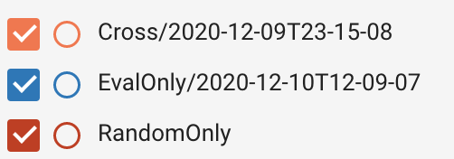

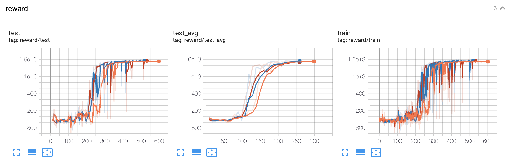

## 3. soft-update tau

> Reference: [https://zhuanlan.zhihu.com/p/86297106?from_voters_page=true](https://zhuanlan.zhihu.com/p/86297106?from_voters_page=true)

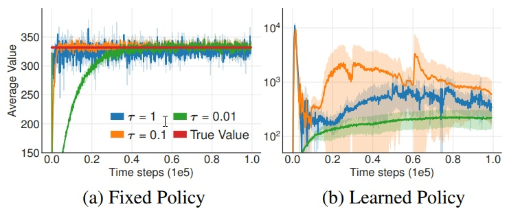

## 4. alpha (entropy offset param)

I find the graph in the SAC paper.

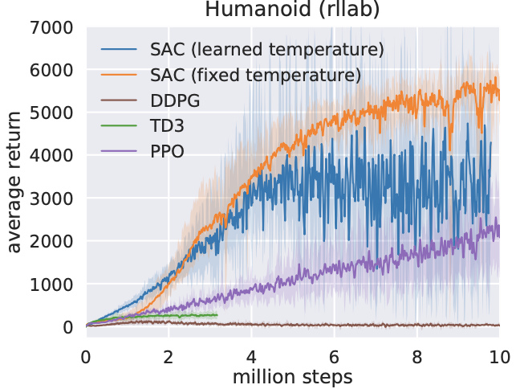

Fixed temperature may be better? (If you know the final alpha)

Then I do a test.(Orange is dynamic-learned-aplha; Blue is a static-alpha 0.035)

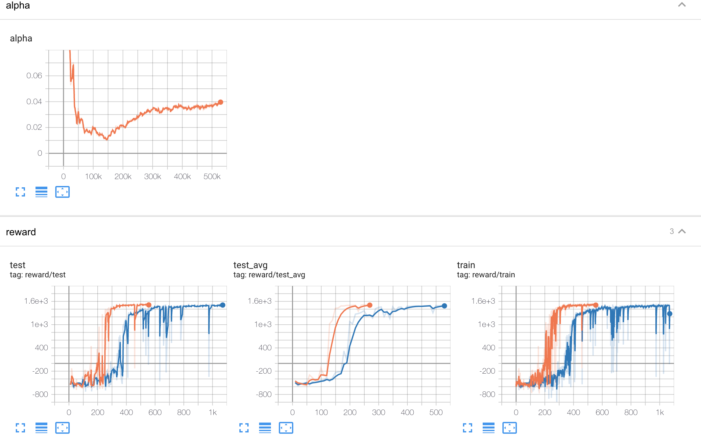

## Questions

1. Actor和Critic的Network是如何得到“最大”Value的 ？
 
> 尝试自答：真正的推力是“最大熵”，“最大熵”的积累推动着该状态下V值的增长！但在高维空间或连续空间中存在不能收敛的风险

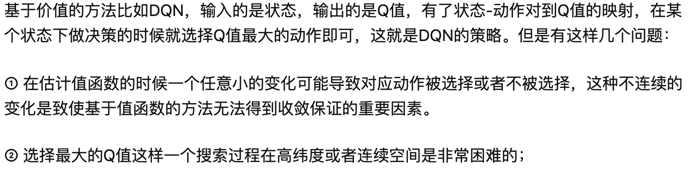

Reference: [https://zhuanlan.zhihu.com/p/36494307](https://zhuanlan.zhihu.com/p/36494307)


2. 是否意味着简单重复状态，如低维度机器人行走状态一旦获取到了正值之后V就能火箭式上升？


